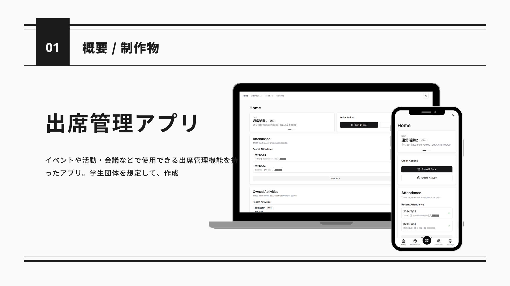
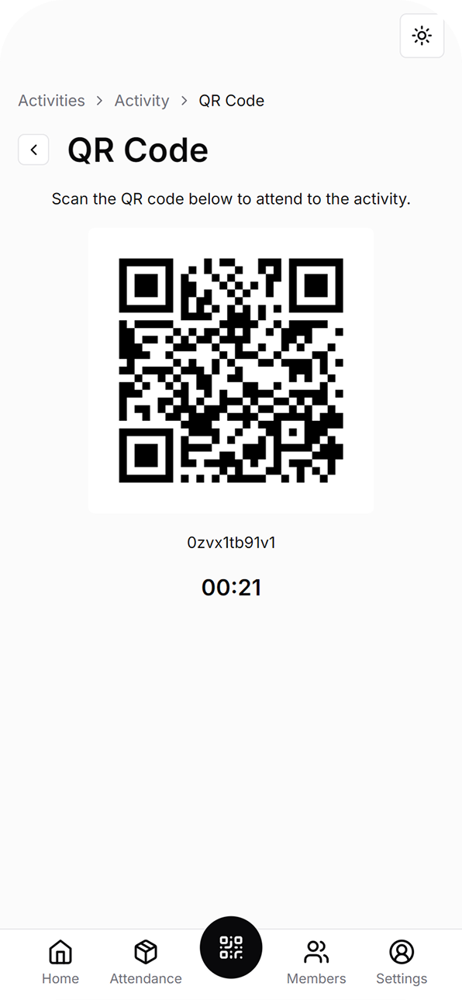
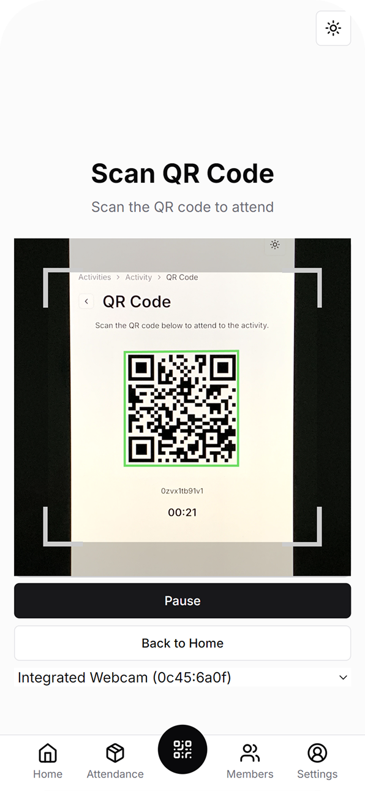
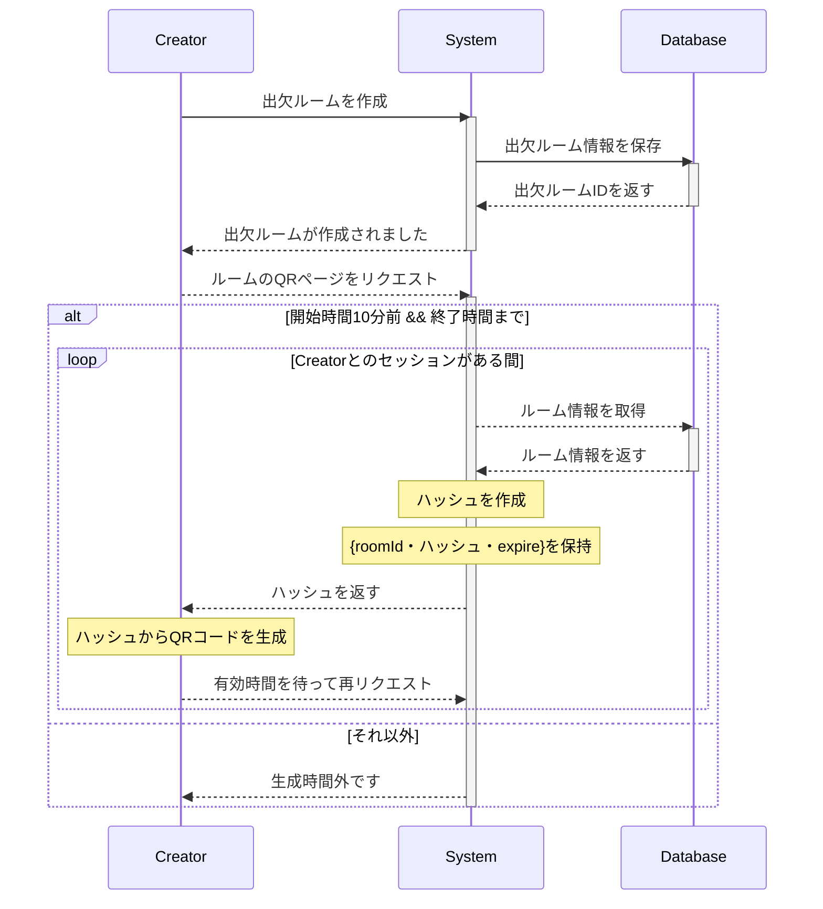
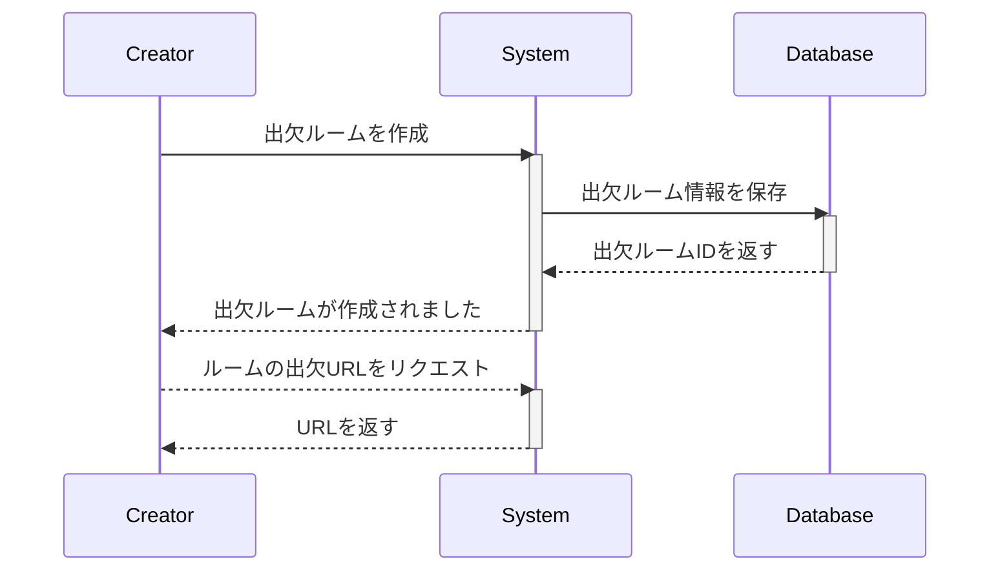
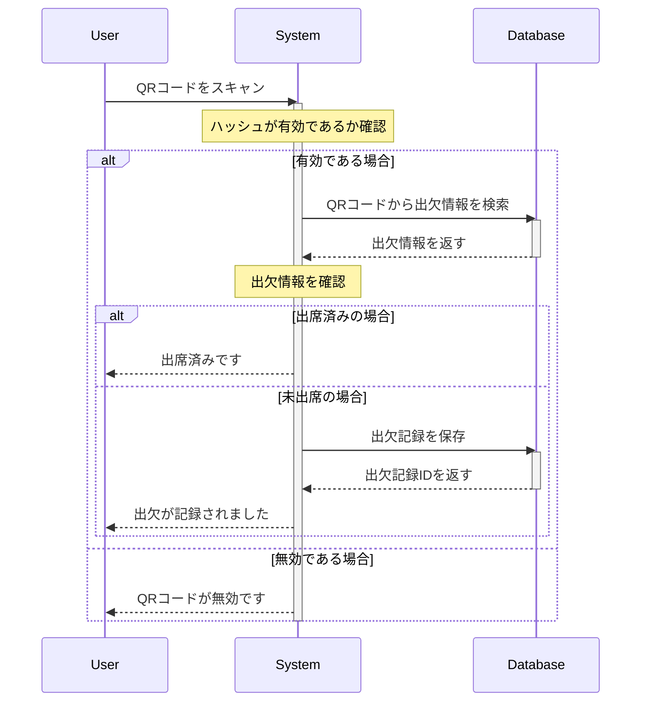
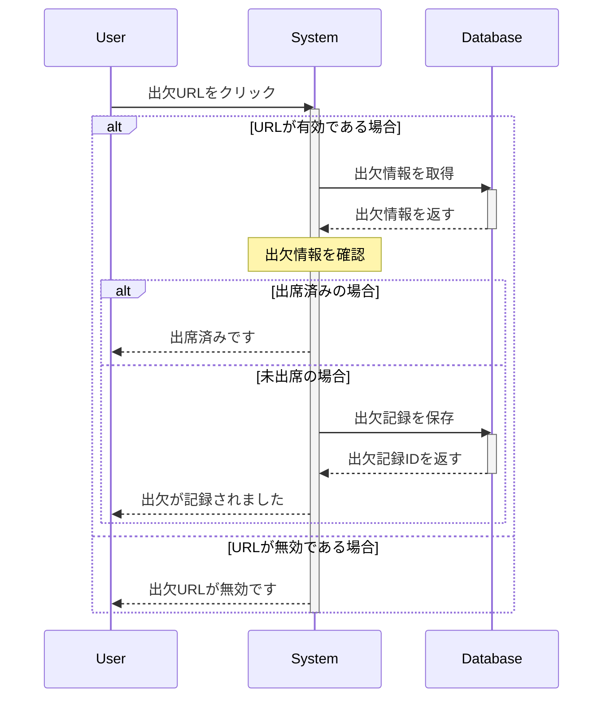

## はじめに

期限付きトークンによる、自動更新のQRコードまたは、固定URLによる出席方法が選べる出席管理アプリ

トークンを node-cache で一定時間保持することにより、出席時のデータベースアクセス回数を減らした



| 発行 | 出席 |
| ---- | ---- |
|  |  |

## シーケンス図

### 活動作成 - QR(オフライン活動など)



### 活動作成 - URL(オンライン活動など)



### 出席処理 - QR



### 出席処理 - URL



## Get Started

### 1. 依存環境のインストール

```bash
$ npm i
```

### 2. 環境変数ファイルを作成

```
# ./.env.local

NEXT_PUBLIC_BASE_URL = "http://localhost:3000"
LOCAL_DATABASE_URL=

# GitHub OAuth認証用（組織で作成）
AUTH_SECRET=
AUTH_GITHUB_ID=
AUTH_GITHUB_SECRET=

# 許可するGitHub組織名を入力
PUBLIC_GITHUB_ORG=

# build 時に必要 Error[UntrustedHost: Host must be trusted]用
NEXTAUTH_URL=http://localhost:3000
AUTH_TRUST_HOST=http://localhost:3000
```

### 3. Prisma Schema を DBに合わせて変更

#### Local PostgreSQL を使用する場合

以下のように変更

```
# prisma/schema.prisma

datasource db {
  provider = "postgresql"
  url      = env("LOCAL_DATABASE_URL")
}
```

### 4. マイグレーション及びシードデータ

#### データベースのマイグレーション

```bash
$ npx prisma generate && npx prisma db push
```

#### シードデータの挿入

以下のようなキャンパスデータが必要となる。
キャンパス情報を基に出席対象者を分けている。

```
# prisma/seed.ts

...
  const campus = await prisma.campus.createMany({
    data: [
      { name: 'Fukakusa', color: '#649360' },
      { name: 'Seta', color: '#3CA6A6' },
      { name: 'Omiya', color: '#9E76B4' },
    ],
  })
...

```

```bash
$ npx prisma db seed
```

### 5. 起動

```bash
$ npm run dev
```
